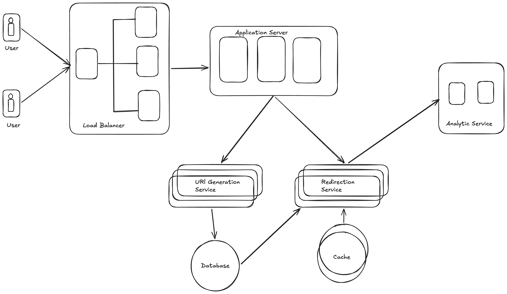

Problem Statement:
    "Design a URL shortening service like TinyURL or Bitly.
    It should allow users to convert a long URL into a short one
    and redirect back to the original URL when accessed."

How I should start answering?
    I will first clarify requirements, then estimate scale, then 
    design high-level components, then go into database and scaling.

Step 1: Requirement Clarification:
    Functional Requirements:
        - User gives long URL -> system returns short URL
        - Visiting shot URL -> redirects to original URL
        - custom short URL(optional)
        - expiry time(optional)
        - analytics(optional)
    Non-Functional Requirements:
        - High availability 
        - Low latency(redirect must be fast)
        - High scalable
        - Durable storage
Step 2: Estimation
    Let's assume:
        * 100M new URLs per month
        * 1B redirects per month
    Storage Calculation
        - if 100M URLs/month = 1.2B URLs/year
    Assume:
        - Original URL = 500 bytes
        - Short key = 8 bytes
        - Metadata = 100 bytes
        ~= 600 bytes per entry
        1.2B * 600 bytes = 720.0 B bytes ~= 720GB/year
    Now using above data i can conclude database must scale horizontally.

Step 3: High Level Architecture.
    
    Core Components:
        - Load Balancer
        - Application Servers
        - Database
        - Cache(Redis)
        - key Generation Service
    

Step 4: Core Design Decisions
    
    1. How to Generate Short URL?
        Option - A: Hashing(MD5):
            - collision possible
            - Cannot guarantee uniqueness
        Option - B: Counter + Base62 Encoding
            What?
                Use auto increament Id and convert Base62.
                Example: ID = 125 , Base62 = "cb"
            why?
                - Guranteed uniqueness
                - Short length
                - Efficient
            When?
                When i need deterministic short codes.
            How?
                - Use DB auto increment Id -> encode -> return
            - Base62 Characters:
                a-z (26)
                A-Z (26
                0-9 (10)
                total = 62
            if we use 7 characters: 
            62^7 ~= 3.5 trillion combinations
            this is enough for internet scale.
Step 5: Database Design:
Table: url_mapping
Column         Type                 Reason
id              bigint              auto increment
short_key       varchar(10)         unique
long_url        text                original
created_at      timestamp           metadata
expiry_at       timestamp           optional

Index: 
    - Primary Key -> id
    - Unique Index -> short_key

Step 6: Read Optimization:
Redirects are read heavy.

Solution: 
    1. User hits short URL
    2. Check Redis
    3. If found -> redirect
    4. Else -> fetch from DB -> store in Redis

Step 7 : Scaling Strategy:

    => Horizonatal Scaling 
    Add more application servers.
    => Database Scaling
    Problem: Auto increment does not scale across multiple DBs.
    Solution: 
        - Use ID generator like Snowflake
        - Or shard database by short_key hash

    => Sharding Strategy:
    shard_id = hash(short_key) % N

    Why?
        - Even distriution
        - Predictable lookup
Step 8: Bottlenecks and Solutions
problem             Solution
================================
DB overload         Cache
Hot URLs            CDN
Traffic spikes      Auto scaling
DB failure          Replication

Step 9: Java Perspective(Backend):
if i will implement then these components i am going to use
    - Spring Boot REST API
    - Redis Template
    - JPA or JDBC
    - Base62 utility class
    - SnowFlake ID generator

below folder structure i am going to follow:
controller/
service/
repository/
model/
util/

Step 10: Advance Considerations:
    - Rate Limiting
    - Abuse detection
    - Analytics via Kafka
    - Event driven logging
    - GDPR deletion support

Final Design Summary or Conclusion:
"
I would design URL shortener using a stateless application layer behind a load balancer,
a distributed database with sharding, Redis for caching heavy reads, Base62 encoding for short key
generation, and replication for availability.
For internet scale, I would introduce Snowflake ID generator and CDN for heavy traffic URLs.
"

